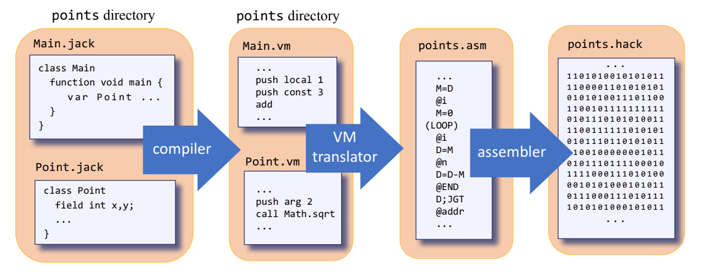
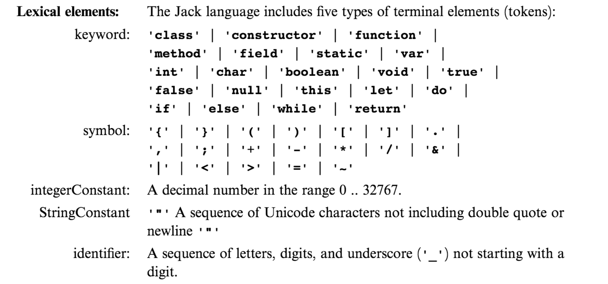
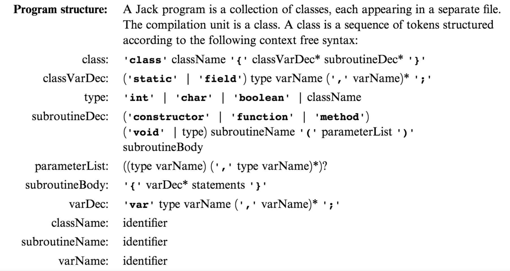
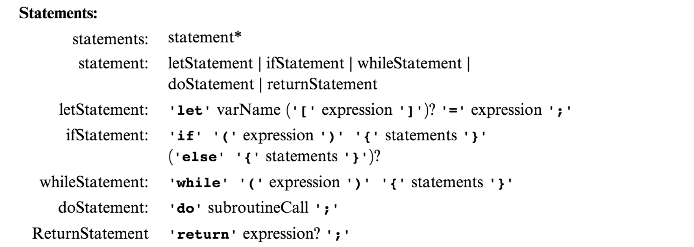
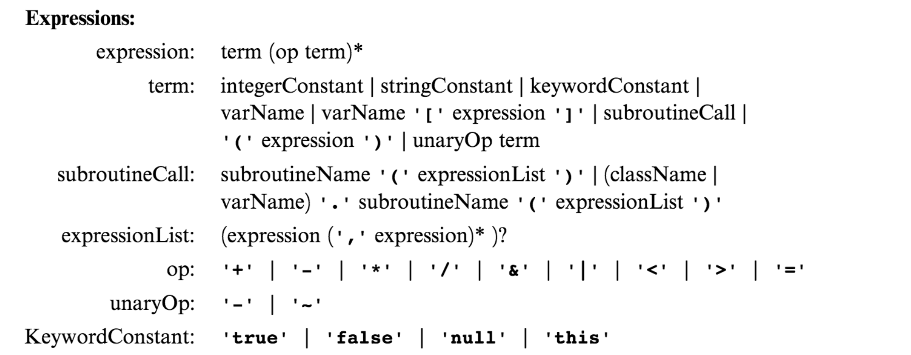
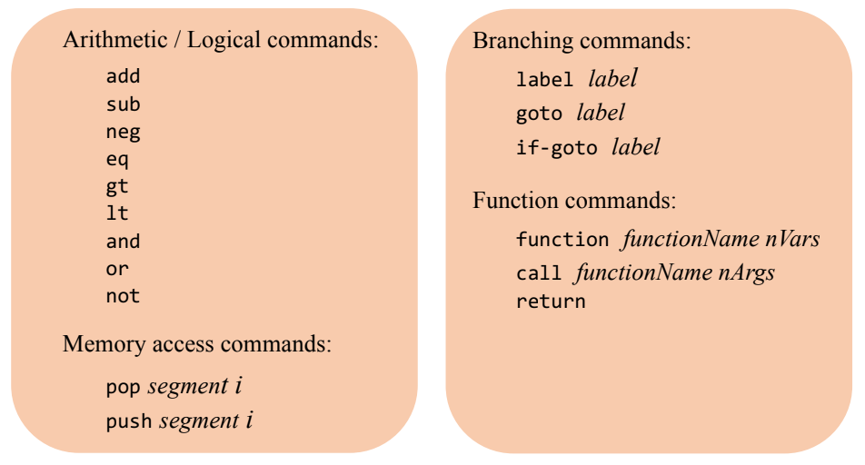
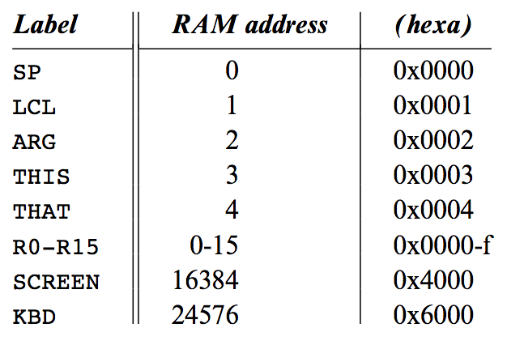
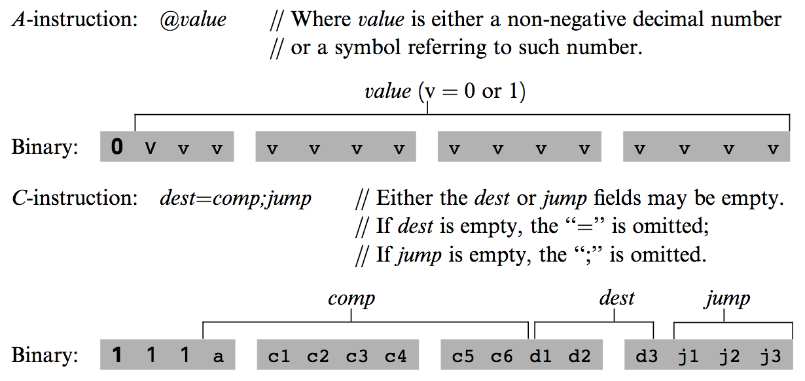
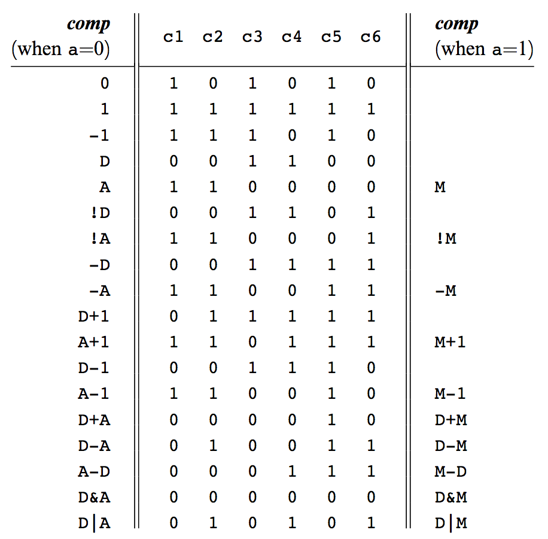
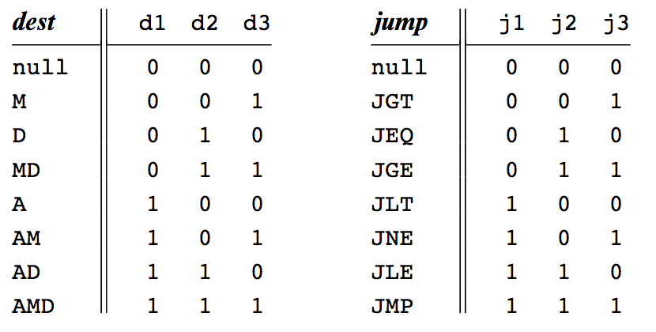

## OVERVIEW
Within, you will find 3 separate directories each containing one program responsible for one part in compiling Jack programs. Respectively, JackCompiler, VMTranslator, and HackAssembler. They behave as follows:

- **JackCompiler:** Takes a `.jack` file as input and outputs a `.vm` file.
- **VMTranslator:** Takes a `.vm` file as input and outputs a `.asm` file.
- **HackAssembler:** Takes a `.asm` file as input and outputs a `.hack` file.

In other words, when combined, these programs will work to compile a `.jack` file into a `.hack` file. These file types are specified by Noam Nissan and Shimon Schocken as part of the Nand2Tetris self-guided course found at www.nand2tetris.org/course. Jack is a Java-like language, and the resulting bytecode produced by this process is designed to work on a custom-built CPU architecture.  

## HOW TO RUN
#### All-in-one
CURRENTLY THE ALL-IN-ONE PROCESS IS INCOMPLETE

#### Jack Compiler
The Jack Compiler will take as argument a folder containing `.jack` files and output compiled `.vm` files to the given input folder. To accomplish this, navigate to the JackCompiler directory within the terminal. From there run the command: 

`java -jar JackCompiler.jar "FOLDER_NAME_HERE"`

The folders "ConvertToBin", "ComplexArrays", "Pong" are included in the JackCompiler directory as test cases for demonstration.

#### VM Translator
The VM Translator will take as argument a folder containing `.vm` files and output translated `.asm` files to the given input folder. To accomplish this, navigate to the VMTranslator directory within the terminal. From there run the command:

`java -jar VMTranslator.jar "FOLDER_NAME_HERE"`

The folders "StaticsTest" and "FibonacciElement" are included in the VMTranslator directory as test cases for demonstration.

#### Hack Assembler
The Hack Assembler will take as argument a file with extension `.asm` files and output an assembled `.hack` file to the same folder. To accomplish this, navigate to the HackAssembler directory within the terminal. From there run the command:

`java -jar HackAssembler.jar "FILE_NAME_HERE_NO_EXTENSION"`

The file "Max.asm" is included in the HackAssembler directory as a test case for demonstration.

### DISCLAIMER!
The below language specifications are designed by Noam Nissan and Shimon Schocken. These descriptions are supplied through their free course at www.nand2tetris.org/course, and edited by me for quick reading here.

## JACK LANGUAGE
Jack is a general-purpose programming language and has "object-based" support. In this regard, it supports objects and classes, but not inheritance. It exists in a space between C and Java, being somewhat clunky, but featuring many of the same basic structures. It is weakly typed and has limited primitive types. There is a supplied standard library through the Jack OS with limited features. 

The Jack Grammar is as follows: 

## VIRTUAL MACHINE LANGUAGE
A VM program is a collection of one or more files with a `.vm` extension, each consisting of one or more  functions. From a compilation standpoint, these constructs correspond, respectively, to the notions of program, class, and method in an object-oriented language.

The language consists of four types of commands:
- Arithmetic commands perform arithmetic and logical operations on the stack.
- Memory access commands transfer data between the stack and virtual memory segments.
- Program flow commands facilitate conditional and unconditional branching operations.
- Function calling commands call functions and return from them.

Segments in the above image refer to memory segments. They are as follows:
- **local, argument, this, that:** Mapped directly on the RAM, and its location is maintained by keeping its physical base address in a dedicated register (LCL, ARG, THIS, and THAT,
respectively). 
- **pointer, temp:** Mapped directly onto a fixed area in the RAM. The pointer segment is mapped on RAM  locations 3-4 (also called THIS and THAT) and the temp segment on locations 5-12 (also called R5, R6,..., R12).
- **constant:** Truly virtual, as it does not occupy any physical space on the target architecture. Instead, the VM implementation handles any VM access to (constant i) by simply supplying the constant i.
- **static:** Accessing static i within file Foo.vm should result in accessing the assembly variable Foo.i

## HACK ASSEMBLY LANGUAGE
An assembly language file is composed of text lines, each representing either an instruction or a symbol declaration
- **Instruction:** An A-instruction or a C-instruction
- **(Symbol):** This pseudo-command binds the Symbol to the memory location into which the next command in the program will be stored. It is called ‘‘pseudo-command’’ since it generates no machine code.

**Constants and Symbols** - Constants must be non-negative and are written in decimal notation. A user-defined symbol can be any sequence of letters, digits, underscore (_), dot (.), dollar sign ($), and colon (:) that does not begin with a digit. 

**Comments** - Text beginning with two slashes (//) and ending at the end of the line is considered a comment and is ignored. 

**White Space** - Space characters are ignored. Empty lines are ignored. 

**Case Conventions** - All the assembly mnemonics must be written in uppercase. The rest (user-defined labels and variable names) is case sensitive. The convention is to use uppercase for labels and lowercase for variable names.

**Predefined Symbols** - Any Hack assembly program is allowed to use the following predefined symbols.

**Label Symbols** - The pseudo-command (Xxx) defines the symbol Xxx to refer to the instruction memory location holding the next command in the program. A label can be defined only once and can be used anywhere in the assembly program, even before the line in which it is defined.

**Variable Symbols** - Any symbol Xxx appearing in an assembly program that is not predefined and is not defined elsewhere using the (Xxx) command is treated as a variable. Variables are mapped to consecutive memory locations as they are first encountered, starting at RAM address 16 (0x0010).

## HACK BYTECODE LANGUAGE
Each line is a sequence of 16 ‘‘0’’ and ‘‘1’’ ASCII characters, coding a single 16-bit machine language instruction. Taken together, all the lines in the file represent a machine language program.

The Hack machine language consists of two instruction types called addressing instruction (A-instruction) and compute instruction (C-instruction). The instruction format is as follows.

The translation of each of the three fields comp, dest, jump to their binary forms is specified in the following three tables.

